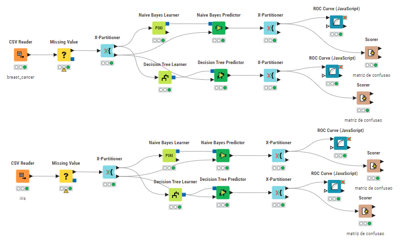

# Extração de Conhecimento e Mineração de Dados

### Ciência de Dados - UNIPÊ - 2023.2

Exercícios práticos utilizados no estudo da disciplina **Extração de Conhecimento e Mineração de Dados** ministrada pelo professor [Ricardo Roberto](https://www.linkedin.com/in/ricardo-roberto-de-lima-1504aa7b/) no **Centro Univesitário de João Pessoa (UNIPÊ)**. Na disciplina foram abordados conceitos de reconhecimento de padrōes, machine learning, modelos preditivos (regressão e classificação), tendo como exemplo Naive Bayes, KNN, Decision Tree e Random Forest. Além do conteúdo teórico, também foi feito exercícios práticos na implementação dos modelos com o uso de plataformas como Jupyter Notebook, Google Colab e KNIME.

